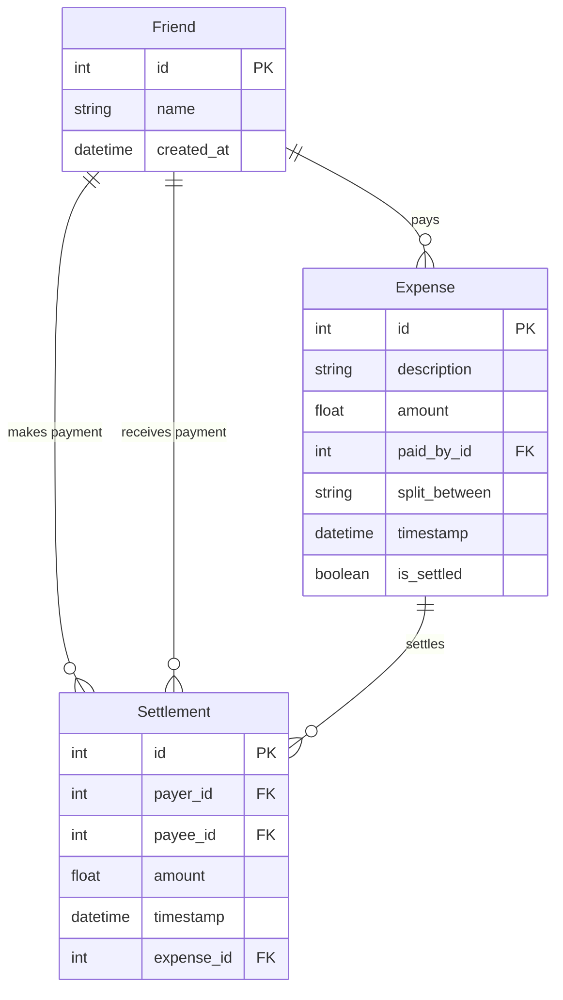

# 💫 SplitMate

<div align="center">


*The elegant way to split expenses with friends*

[](https://python.org)
[](https://flask.palletsprojects.com/)
[](https://sqlalchemy.org)
[](LICENSE)


</div>

---

## ✨ Features

### 🎯 **Core Functionality**
- **Smart Expense Splitting** - Automatically calculate fair splits among friends
- **Real-time Balance Tracking** - See who owes what at a glance
- **Settlement Management** - Record payments and settle debts seamlessly
- **Monthly Summaries** - Detailed breakdown of expenses and settlements

### 🎨 **Premium Design**
- **Glassmorphism UI** - Modern, elegant interface with blur effects
- **Responsive Design** - Perfect on desktop, tablet, and mobile
- **Interactive Elements** - Smooth animations and micro-interactions
- **Dark/Light Themes** - Comfortable viewing in any lighting

### 🔒 **Security & Performance**
- **CSRF Protection** - Secure forms with token validation
- **SQLite Database** - Reliable local data storage
- **Optimized Queries** - Fast performance with proper indexing
- **Error Handling** - Graceful error management and user feedback

---

## 🎥 Demo

### Dashboard Overview
```
📊 Dashboard
├── Total Spent: ₹15,420
├── Active Friends: 8
├── Pending Settlements: 3
└── Recent Activity Timeline
```

### Key Screens
| Screen | Description |
|--------|-------------|
| 🏠 **Dashboard** | Overview of expenses, balances, and recent activity |
| ➕ **Add Expense** | Beautiful form with smart friend selection |
| 👥 **Manage Friends** | Add, edit, and remove friends from your circle |
| ⚖️ **Settle Payments** | Record payments and clear debts |
| 📈 **Monthly Summary** | Detailed analytics and expense breakdowns |

---

## 🚀 Installation

### Prerequisites
- Python 3.8 or higher
- pip package manager

### Quick Start

```bash
# Clone the repository
git clone https://github.com/yourusername/splitmate.git
cd splitmate

# Create virtual environment
python -m venv venv

# Activate virtual environment
# On Windows:
venv\Scripts\activate
# On macOS/Linux:
source venv/bin/activate

# Install dependencies
pip install -r requirements.txt

# Initialize database
python app.py
```

### Manual Setup

1. **Install Flask and dependencies:**
   ```bash
   pip install flask flask-sqlalchemy flask-wtf
   ```

2. **Set up environment variables:**
   ```bash
   export FLASK_APP=app.py
   export FLASK_ENV=development
   export SECRET_KEY=your-super-secret-key-here
   ```

3. **Run the application:**
   ```bash
   flask run
   ```

The app will be available at `http://localhost:5000` 🎉

---

## 📖 Usage

### Adding Your First Expense

1. **Add Friends**: Start by adding your friends in the "Manage Friends" section
2. **Create Expense**: Click the floating "+" button to add a new expense
3. **Split Smart**: Select who participated in the expense
4. **Track Balance**: View real-time balances on your dashboard

### Settling Payments

```python
# Example: John pays back ₹500 to Sarah
Payer: John
Payee: Sarah  
Amount: ₹500.00
```

### Monthly Analytics

Generate detailed reports to understand spending patterns:
- **Total expenses** per person
- **Net balances** and settlements
- **Category-wise** breakdowns
- **Time-based** trends

---

## 🏗️ Architecture

### Project Structure
```
splitmate/
├── 📁 static/
│   └── styles.css          # Global styles and themes
├── 📁 templates/
│   ├── dashboard.html      # Main dashboard
│   ├── add_expense.html    # Expense creation form
│   ├── friends.html        # Friend management
│   ├── settle.html         # Payment settlement
│   └── monthly_summary.html # Analytics dashboard
├── 📄 app.py              # Main Flask application
├── 📄 models.py           # Database models
├── 📄 extensions.py       # Flask extensions
└── 📄 requirements.txt    # Python dependencies
```

### Database Schema



---

## 🔧 API Reference

### Expense Management

| Endpoint | Method | Description |
|----------|--------|-------------|
| `/add` | GET, POST | Add new expense |
| `/dashboard` | GET | View dashboard |
| `/delete_expense/<id>` | POST | Delete expense |

### Friend Management

| Endpoint | Method | Description |
|----------|--------|-------------|
| `/friends` | GET, POST | Manage friends |
| `/delete_friend/<id>` | POST | Remove friend |

### Settlement Operations

| Endpoint | Method | Description |
|----------|--------|-------------|
| `/settle` | GET, POST | Record settlement |
| `/delete_settlement/<id>` | POST | Remove settlement |

### Analytics

| Endpoint | Method | Description |
|----------|--------|-------------|
| `/summary` | GET | Monthly summary |
| `/history` | GET | Transaction history |

---

## 🎨 Customization

### Themes & Styling

SplitMate uses CSS custom properties for easy theming:

```css
:root {
    --primary: #7B68EE;      /* Primary brand color */
    --secondary: #20C5C5;    /* Secondary accent */
    --success: #2ECC71;      /* Success states */
    --danger: #FF4757;       /* Error states */
}
```

### Adding New Features

1. **Create new route** in `app.py`
2. **Add database model** in `models.py` if needed
3. **Design template** with consistent styling
4. **Update navigation** and user flows

---

## 🤝 Contributing

We love contributions! Here's how you can help make SplitMate even better:

### Getting Started
1. **Fork** the repository
2. **Create** a feature branch: `git checkout -b feature/amazing-feature`
3. **Commit** your changes: `git commit -m 'Add amazing feature'`
4. **Push** to the branch: `git push origin feature/amazing-feature`
5. **Open** a Pull Request

### Development Guidelines
- Follow **PEP 8** for Python code style
- Add **tests** for new features
- Update **documentation** as needed
- Use **semantic commit messages**

### Areas We Need Help
- 🐛 **Bug Fixes** - Help us squash bugs
- ✨ **New Features** - Implement roadmap items
- 📚 **Documentation** - Improve guides and API docs
- 🎨 **UI/UX** - Enhance user experience
- 🧪 **Testing** - Add test coverage

---

<div align="center">

**Made with ❤️ for friends who split bills together**

⭐ Star us on GitHub if you find SplitMate useful!

[⬆ Back to Top](#-splitmate)

</div>
